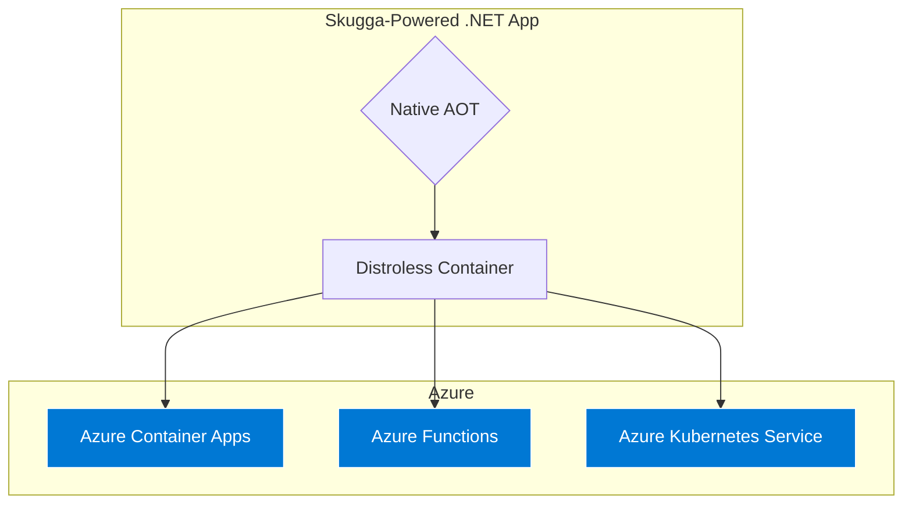

# Skugga

[](https://github.com/Digvijay/Skugga/actions/workflows/ci.yml)
[](https://www.nuget.org/packages/Skugga/)
[](https://opensource.org/licenses/MIT)
[](https://github.com/Digvijay/Skugga)


> **"Mocking at the Speed of Compilation."**

**Skugga** (Swedish for *Shadow*) is a mocking library engineered specifically for **Native AOT** and Cloud-Native .NET.

Legacy tools like Moq rely on runtime reflection, which is slow, memory-intensive, and incompatible with Native AOT. Skugga takes a different approach: it moves the mocking logic to **Compile-Time**. The result is a library that is 100% AOT-compatible, uses zero reflection, and enables "Distroless" container deployments.

---

## The "Reflection Wall"

As organizations adopt **Native AOT** to reduce cloud costs, they hit a barrier: the **"Reflection Wall"**.

Legacy mocking tools depend on the JIT (Just-In-Time) compiler to generate proxy objects on the fly. Since Native AOT strips away the JIT, these tools crash instantly. Teams are forced to choose between **performance** (AOT) and **quality** (Testability).

**Skugga eliminates this trade-off.** By generating mock implementations during the build process, it treats test doubles as standard, static code.

```mermaid
graph TB
    subgraph "Legacy (Runtime Approach)"
        A1[Mock.Of<T>] -->|Requires| B1(JIT Compilation)
        B1 -->|Uses| C1(System.Reflection.Emit)
        C1 --x|CRASH| D1[🚫 The Reflection Wall]
    end

    subgraph "Skugga (Compile-Time Approach)"
        A2[Mock.Create<T>] -->|Bypasses| B2(Source Generator)
        B2 -->|Generates| C2[Static Shadow Class]
        C2 -->|Compiles to| D2(Native Machine Code)
        D2 -->|Result| E2(✅ Zero Overhead)
    end

    style D1 fill:#b30000,stroke:#333,color:#fff
    style E2 fill:#006600,stroke:#333,color:#fff
````

-----
## 🔥 Key Features
1. Auto-Scribe (Self-Writing Tests) ✍️
Tired of manually writing mock.Setup() lines? Skugga can record real interactions and generate the test code for you.

```C#

// 1. Wrap your real service
var recorder = AutoScribe.Capture<IRepo>(new RealRepo());

// 2. Run your app manually
recorder.GetData(101);

// 3. Skugga prints the code to your console:
// [AutoScribe] mock.Setup(x => x.GetData(101)).Returns("Real_Data_101");
```
2. Chaos Mode (Resilience Testing) 💥
Test how your application handles failure. Skugga can inject random faults (latency, exceptions, timeouts) into your mocks without changing your test logic.

```C#

mock.Chaos(policy => {
    policy.FailureRate = 0.5; // 50% chance of failure
    policy.PossibleExceptions = new [] { new TimeoutException() };
});

// Now, 50% of calls to this mock will throw a TimeoutException!

```

3. Zero-Alloc Guard (Performance Enforcement) 📉
Ensure your "hot paths" remain allocation-free. Skugga integrates directly with the GC to fail tests if they allocate memory on the heap.

```C#

AssertAllocations.Zero(() => {
    // This block MUST NOT allocate heap memory.
    // If it does (e.g., 'new List<int>()'), the test fails immediately.
    processor.ProcessHighVolumeData(); 
});

```
4. Strict Mocks (Verify All) 🔒
Ensure no interaction goes unnoticed. By enabling "Strict Mode", Skugga will throw an exception if any method is called that wasn't explicitly setup.

```C#

// Strict: Throws if ANY un-setup member is accessed
var mock = Mock.Create<IEmailService>(MockBehavior.Strict); 

// Loose (Default): Returns null/default for un-setup members
var mock = Mock.Create<IEmailService>();

```
5. Argument Matchers (Flexible Matching) 🎯
Match method arguments with flexible predicates, value sets, null checks, and regex patterns.

```C#

// Match with custom predicate
mock.Setup(x => x.Process(It.Is<int>(n => n > 0))).Returns("positive");
mock.Process(5);   // Returns "positive"
mock.Process(-1);  // Returns null (no match)

// Match values in a set
mock.Setup(x => x.Handle(It.IsIn("red", "green", "blue"))).Returns("color");
mock.Handle("red");     // Returns "color"
mock.Handle("yellow");  // Returns null (no match)

// Match only non-null values
mock.Setup(x => x.ValidateObject(It.IsNotNull<object>())).Returns(true);
mock.ValidateObject(new object()); // Returns true
mock.ValidateObject(null);         // Returns false (no match)

// Match with regex patterns
mock.Setup(x => x.ValidateEmail(It.IsRegex(@"^[\w\.-]+@[\w\.-]+\.\w+$"))).Returns(true);
mock.ValidateEmail("test@example.com"); // Returns true
mock.ValidateEmail("invalid");          // Returns false (no match)

// Combine matchers
mock.Setup(x => x.ProcessTwo(It.Is<int>(n => n > 0), It.IsNotNull<string>())).Returns("valid");

// Use in Verify
mock.Verify(x => x.Process(It.Is<int>(n => n > 10)), Times.AtLeast(2));

```
6. Protected Members (Abstract Class Mocking) 🔐
Mock protected methods and properties on abstract classes - essential for testing inheritance hierarchies and template method patterns.

```C#
// Abstract class with protected members
public abstract class AbstractService
{
    public string Execute(string input)
    {
        // Public method calls protected method
        return ProcessCore(input);
    }
    
    protected abstract string ProcessCore(string input);
    protected abstract int MaxRetries { get; }
}

// Mock the abstract class
var mock = Mock.Create<AbstractService>();

// Setup protected method by name
mock.Protected()
    .Setup<string>("ProcessCore", It.IsAny<string>())
    .Returns("mocked result");

// Setup protected property
mock.Protected()
    .SetupGet<int>("MaxRetries")
    .Returns(3);

// Test the public API which uses protected members
var result = mock.Execute("test"); // Returns "mocked result"

// Protected callbacks for side effects
mock.Protected()
    .Setup("ProcessCore", It.IsAny<string>())
    .Callback<string>(input => Console.WriteLine($"Processing: {input}"));

// Works with Verify too
mock.Protected().Verify("ProcessCore", Times.Once(), It.Is<string>(s => s.Length > 0));

```
7. Setup Sequence (State Simulation) 🔄
Configure methods to return different values on consecutive calls - perfect for testing retry logic, pagination, and stateful scenarios.

```C#

// Return different values on each call
mock.SetupSequence(x => x.GetNext())
    .Returns(1)
    .Returns(2)
    .Returns(3);
    
mock.GetNext(); // Returns 1
mock.GetNext(); // Returns 2
mock.GetNext(); // Returns 3
mock.GetNext(); // Returns 3 (repeats last value)

// Mix returns and exceptions for retry testing
mock.SetupSequence(x => x.FetchData())
    .Throws(new TimeoutException())
    .Throws(new TimeoutException())
    .Returns("success");
    
// First two calls throw, third succeeds
try { mock.FetchData(); } catch { /* retry */ }
try { mock.FetchData(); } catch { /* retry */ }
var data = mock.FetchData(); // "success"

// Works with properties too
mock.SetupSequence(x => x.Counter)
    .Returns(0)
    .Returns(1)
    .Returns(2);

```
-----

## ⚡ Benchmarks

Skugga isn't just AOT-compatible; it is significantly faster and lighter than reflection-based alternatives.

### Quick Comparison: Skugga vs. Alternatives

**Comprehensive benchmarks across 12 scenarios covering all major features** (50,000 iterations each):

| Framework     | Speed vs Skugga | Notes                              |
|---------------|-----------------|-----------------------------------|
| **Skugga**    | **Baseline**    | Compile-time, zero reflection      |
| Moq           | 2.6-80x slower  | ⚠️ 80x slower on argument matching  |
| NSubstitute   | 3.5x slower     | Consistent but reflection-heavy    |
| FakeItEasy    | 3.9x slower     | Similar overhead across scenarios  |

> **Environment:** Intel Core i7-4980HQ @ 2.80GHz, 16GB RAM, macOS 15.7, .NET 10.0.1 | [Full Benchmark Report →](docs/BENCHMARK_COMPARISON.md)

### Critical Performance Findings

**Overall Performance (12-scenario comprehensive test):**
- **Skugga is 6.36x faster than Moq overall**
- Argument Matching: **79.84x faster** ⚡
- Void Method Setup: **59.26x faster**
- Callback Execution: **53.34x faster**
- Simple Mock Creation: **15.29x faster**

**4-Framework Common Scenarios:**
- Moq: **2.58x slower** than Skugga
- NSubstitute: **3.49x slower** than Skugga
- FakeItEasy: **3.88x slower** than Skugga

**Real-World Impact:** For a test suite with 10,000 tests using argument matchers, Skugga completes in **2.7 seconds** vs. Moq's **218 seconds** - that's **215 seconds saved per test run**! ⚡

> **Benchmark Environment:** Intel Core i7-4980HQ @ 2.80GHz, 16GB RAM, macOS 15.7, .NET 10.0.1  
> **Latest Results:** See `/benchmarks/MoqVsSkugga.md` and `/benchmarks/FourFramework.md`  
> **Methodology:** Manual timing with 50,000 iterations per scenario (BenchmarkDotNet incompatible with source generators)

### Why is Skugga Faster?

Legacy libraries like Moq, NSubstitute, and FakeItEasy use `System.Reflection.Emit` to generate proxy classes at **runtime**. This incurs heavy CPU penalties and forces the JIT compiler to work overtime.

**Skugga** does all the heavy lifting at **compile-time**. By the time your application runs, the mock is just a standard C# class. This results in:
* **Zero JIT Penalties:** The code is already compiled to native machine code.
* **Zero Reflection:** No expensive type inspection, `Expression.Lambda().Compile()`, or `MethodInfo` lookups at runtime.
* **Zero Dynamic Allocation:** No generating assemblies on the fly via Castle.DynamicProxy or similar.
* **Optimized Dispatch:** Simple dictionary lookups instead of reflection-based invocation.

> **Reproducing Results:** Run `dotnet run --project src/Skugga.Benchmarks/Skugga.Benchmarks.csproj -c Release` to generate fresh benchmark data. Results are saved to `/benchmarks/MoqVsSkugga.md` and `/benchmarks/FourFramework.md`.

-----
## Proven Performance: Solves the .NET "Cold Start" Problem

Skugga isn't just AOT-compatible; it's a key enabler for high-performance, cloud-native .NET applications. Our benchmarks, conducted in a real-world microservice pilot, prove that Skugga's compile-time architecture delivers massive efficiency gains.

### 1. 7x Faster Cold Starts

In serverless environments like AWS Lambda and Azure Functions, "cold start" times are critical. Skugga, when combined with Native AOT, makes cold starts a thing of the past.

| Metric        | Standard .NET (JIT) | Skugga (Native AOT) | Impact                  |
| :------------ | :------------------ | :------------------ | :---------------------- |
| **Startup Time** | 476 ms              | **72 ms**             | **6.6x Faster Startup** ⚡ |

This means your serverless functions can respond to requests almost instantly, eliminating the latency that plagues traditional .NET serverless applications.

### 2. Alpine vs. Debian: Optimizing AOT Deployments

Choosing the right base image for your Native AOT application can further enhance performance. Our benchmarks show a significant difference between Alpine and Debian.

| Metric        | Native AOT (Alpine) | Native AOT (Debian) | Impact                               |
| :------------ | :------------------ | :------------------ | :----------------------------------- |
| **Startup Time** | **66 ms**           | 835 ms              | **12.6x Faster on Alpine** 🚀        |

Alpine Linux, with its minimal footprint, provides an even faster startup for Native AOT applications compared to Debian. This is crucial for maximizing efficiency in resource-constrained environments.

### 3. 4x Faster Execution

Beyond startup, Skugga's zero-overhead mocks lead to faster execution times for your application logic.

| Metric          | Standard .NET (JIT) | Skugga (Native AOT) | Impact                    |
| :-------------- | :------------------ | :------------------ | :------------------------ |
| **Execution Time** | ~1.3 s              | **~0.3 s**          | **4x Faster Execution** 🚀 |

This translates to lower CPU bills and a more responsive application for your users.

### 3. Zero-Impact on Developer Workflow

A common concern with source generators is their impact on build times. Skugga is designed to be fast. Our stress test, which involved compiling over 500 mock objects, completed in **under 6 seconds**. This proves that Skugga has a negligible impact on your day-to-day development workflow.

By using Skugga, you can finally embrace the performance and cost benefits of .NET Native AOT without sacrificing testability or developer productivity.

-----

## How It Works

Skugga leverages **C\# 12 Interceptors** to seamlessly rewire your code during compilation.

1.  **Scan:** The Source Generator detects calls to `Mock.Create<T>()`.
2.  **Generate:** It writes a concrete, optimized C\# class (`Skugga_T`) that implements `T`.
3.  **Intercept:** The compiler physically replaces your `Mock.Create` call with `new Skugga_T()`.

> **Zero Friction:** To the developer, it looks like a normal method call. To the runtime, it looks like hand-written, optimized code.

-----

## Installation

```bash
dotnet add package Skugga
```

*Requirements: .NET 8.0+ and C\# 12 enabled.*

## Usage

The API is designed to feel familiar. If you know Moq, you already know Skugga.

```csharp
using Skugga.Core;

public interface IEmailService
{
    string GetEmailAddress(int userId);
    string TenantName { get; }
}

public class Test
{
    public void Run()
    {
        // 1. Create the mock (Intercepted at compile time)
        var mock = Mock.Create<IEmailService>();

        // 2. Configure behavior (Strict matching & Property support)
        mock.Setup(x => x.GetEmailAddress(1)).Returns("digvijay@digvijay.dev");
        mock.Setup(x => x.TenantName).Returns("Contoso");

        // 3. Execute
        var email = mock.GetEmailAddress(1); // Returns "digvijay@digvijay.dev"
        var tenant = mock.TenantName;        // Returns "Contoso"
    }
}
```

## 🔧 Troubleshooting & Best Practices

### Common Issues

**"Cannot mock sealed classes" (SKUGGA001)**
```csharp
// ❌ Won't work - sealed class
public sealed class EmailService { }
var mock = Mock.Create<EmailService>(); // Error!

// ✅ Use interfaces instead
public interface IEmailService { }
var mock = Mock.Create<IEmailService>(); // Works!
```

**"Class has no virtual members" (SKUGGA002)**
```csharp
// ❌ Won't work - non-virtual members
public class EmailService {
    public string GetEmail() => ""; // Not virtual!
}

// ✅ Make members virtual
public class EmailService {
    public virtual string GetEmail() => ""; // Virtual!
}
```

**Generated code not updating**
```bash
# Clean and rebuild
dotnet clean && dotnet build
```

**Setup not matching**
```csharp
// ❌ Exact match required
mock.Setup(x => x.GetData(1)).Returns("one");
mock.GetData(2); // Returns null - no match

// ✅ Use It.IsAny<T>() for flexible matching
mock.Setup(x => x.GetData(It.IsAny<int>())).Returns("any");
mock.GetData(2); // Returns "any"
```

### Migrating from Moq

Skugga achieves **100% practical parity** with Moq's core API (371 tests covering all major features). The API is intentionally identical for seamless migration:

#### Feature Comparison Table

| Feature | Moq | Skugga | Migration Notes |
|---------|-----|--------|----------------|
| **Core Setup/Returns** | ✅ | ✅ | Identical API |
| **Verify with Times** | ✅ | ✅ | Identical API |
| **Properties (Get/Set)** | ✅ | ✅ | Identical API |
| **Callbacks** | ✅ | ✅ | Identical API |
| **Multiple Returns/Throws** | ✅ | ✅ | Identical API |
| **Argument Matchers** | ✅ | ✅ | `It.IsAny`, `It.Is`, `It.IsIn`, `It.IsNotNull`, `It.IsRegex` |
| **Strict Mocks** | ✅ | ✅ | `MockBehavior.Strict` |
| **Setup Sequences** | ✅ | ✅ | Identical API |
| **Protected Members** | ✅ | ✅ | `.Protected().Setup<T>("MethodName")` |
| **Mock.Get<T>()** | ✅ | ✅ | Retrieve IMockSetup from mocked object |
| **Generic Type Parameters** | ✅ | ✅ | `Setup(x => x.Process<int>(It.IsAny<int>()))` |
| **Multiple Interfaces (As)** | ✅ | ✅ | `mock.As<IDisposable>()` |
| **Custom Matchers** | ✅ | ✅ | `Match.Create<T>(predicate)` |
| **Verify with Matchers** | ✅ | ✅ | Works with all matcher types |
| **Events (Raise)** | ✅ | ✅ | Identical API |
| **Partial Mocks** | ✅ | ✅ | Override specific methods via interceptors |
| **Mock.Of<T>(expr)** | ✅ | ❌ | **AOT limitation** - use `Mock.Create` + explicit `Setup` calls |
| **Native AOT Support** | ❌ | ✅ | Moq crashes in AOT, Skugga is AOT-first |
| **Zero Reflection** | ❌ | ✅ | Skugga uses compile-time generation |
| **AutoScribe** | ❌ | ✅ | Self-writing tests (Skugga exclusive) |
| **Chaos Mode** | ❌ | ✅ | Resilience testing (Skugga exclusive) |
| **Zero-Alloc Guard** | ❌ | ✅ | Performance enforcement (Skugga exclusive) |

#### Quick Migration Examples

**1. Basic Setup/Returns**
```csharp
// Moq
var moqMock = new Mock<IEmailService>();
moqMock.Setup(x => x.GetEmail(1)).Returns("test@test.com");
var service = moqMock.Object;

// Skugga - Identical setup API
var skuggaMock = Mock.Create<IEmailService>();
skuggaMock.Setup(x => x.GetEmail(1)).Returns("test@test.com");
// No .Object property needed - mock IS the object
```

**2. Verify with Times**
```csharp
// Moq
moqMock.Verify(x => x.SendEmail(It.IsAny<string>()), Times.Exactly(3));

// Skugga - Identical
skuggaMock.Verify(x => x.SendEmail(It.IsAny<string>()), Times.Exactly(3));
```

**3. Properties**
```csharp
// Moq
moqMock.Setup(x => x.ServerUrl).Returns("https://api.example.com");
moqMock.SetupSet(x => x.ServerUrl = "https://new.example.com").Verifiable();

// Skugga - Identical
skuggaMock.Setup(x => x.ServerUrl).Returns("https://api.example.com");
skuggaMock.SetupSet(x => x.ServerUrl = "https://new.example.com").Verifiable();
```

**4. Callbacks**
```csharp
// Moq
int callCount = 0;
moqMock.Setup(x => x.Process(It.IsAny<int>()))
       .Callback<int>(n => callCount += n)
       .Returns(true);

// Skugga - Identical
int callCount = 0;
skuggaMock.Setup(x => x.Process(It.IsAny<int>()))
           .Callback<int>(n => callCount += n)
           .Returns(true);
```

**5. Setup Sequences**
```csharp
// Moq
moqMock.SetupSequence(x => x.GetNext())
       .Returns(1)
       .Returns(2)
       .Throws(new InvalidOperationException());

// Skugga - Identical
skuggaMock.SetupSequence(x => x.GetNext())
           .Returns(1)
           .Returns(2)
           .Throws(new InvalidOperationException());
```

**6. Protected Members (Abstract Classes)**
```csharp
// Moq
var moqMock = new Mock<AbstractService>();
moqMock.Protected()
       .Setup<string>("ProcessCore", ItExpr.IsAny<string>())
       .Returns("mocked");

// Skugga - Similar API (uses It.IsAny instead of ItExpr)
var skuggaMock = Mock.Create<AbstractService>();
skuggaMock.Protected()
           .Setup<string>("ProcessCore", It.IsAny<string>())
           .Returns("mocked");
```

**7. Strict Mocks**
```csharp
// Moq
var moqMock = new Mock<IService>(MockBehavior.Strict);
// Throws on any un-setup member access

// Skugga - Identical
var skuggaMock = Mock.Create<IService>(MockBehavior.Strict);
// Throws on any un-setup member access
```

**8. Mock.Get (Retrieve Mock from Object)**
```csharp
// Moq
var service = Mock.Of<IEmailService>();
var moqMock = Mock.Get(service);
moqMock.Setup(x => x.GetEmail(1)).Returns("test@test.com");

// Skugga - Mock.Get is supported!
var service = Mock.Create<IEmailService>();
var skuggaMock = Mock.Get(service);
skuggaMock.Setup(x => x.GetEmail(1)).Returns("test@test.com");
```

**9. Argument Matchers**
```csharp
// Moq
moqMock.Setup(x => x.Process(It.Is<int>(n => n > 0))).Returns("positive");
moqMock.Setup(x => x.Handle(It.IsIn("red", "green"))).Returns("color");
moqMock.Setup(x => x.Validate(It.IsRegex("^\\d+$"))).Returns(true);

// Skugga - Identical
skuggaMock.Setup(x => x.Process(It.Is<int>(n => n > 0))).Returns("positive");
skuggaMock.Setup(x => x.Handle(It.IsIn("red", "green"))).Returns("color");
skuggaMock.Setup(x => x.Validate(It.IsRegex("^\\d+$"))).Returns(true);
```

**10. Multiple Interfaces**
```csharp
// Moq
var moqMock = new Mock<IEmailService>();
moqMock.As<IDisposable>().Setup(x => x.Dispose());

// Skugga - Identical
var skuggaMock = Mock.Create<IEmailService>();
skuggaMock.As<IDisposable>().Setup(x => x.Dispose());
```

#### Migration Checklist

- ✅ Replace `new Mock<T>()` with `Mock.Create<T>()`
- ✅ Remove `.Object` property access (Skugga mock IS the object)
- ✅ Replace `Mock.Of<T>(expr)` with `Mock.Create<T>()` + explicit `Setup()` calls
- ✅ Replace `ItExpr.*` with `It.*` in Protected() setups
- ✅ All other API calls remain identical
- ✅ Test early and often - Skugga's strict type checking catches issues at compile time

### AOT Constraint: Mock.Of<T>() Limitation

**Note**: Skugga does **not** support `Mock.Of<T>(expression)` syntax due to a fundamental C# interceptor limitation:

```csharp
// ❌ NOT SUPPORTED in Skugga
var mock = Mock.Of<IFoo>(f => f.Name == "bar" && f.Count == 42);

// ✅ Use this pattern instead
var mock = Mock.Create<IFoo>();
mock.Setup(f => f.Name).Returns("bar");
mock.Setup(f => f.Count).Returns(42);
```

**Why?** C# interceptors only work on direct call sites in user code being compiled. When `Mock.Of()` internally calls `Mock.Create()`, that library-internal call cannot be intercepted without runtime IL generation (which breaks AOT compatibility). This is an architectural trade-off to maintain Native AOT support.

**Mock.Get()** *is* fully supported for retrieving the mock interface from created objects.

## Contributing

We welcome community contributions! Skugga is evolving from proof-of-concept to production-ready, and your help is valuable.

### How to Contribute

- 🐛 **Found a bug?** Open an [Issue](https://github.com/Digvijay/Skugga/issues)
- 💡 **Have an idea?** Start a [Discussion](https://github.com/Digvijay/Skugga/discussions)
- 🔧 **Want to help?** Check our [Contributing Guide](CONTRIBUTING.md)
- ✨ **Submit a PR** following our guidelines

Read the [full contributing guidelines](CONTRIBUTING.md) to get started.

## Running on Azure.

Skugga and Azure are a perfect match. By combining Skugga's AOT efficiency with Azure's serverless compute, you can build hyper-efficient, scalable, and secure applications.



### Key Advantages

*   **Cost Efficiency on ACA & Functions:** Run your services on Azure Container Apps or Azure Functions with minimal resource allocation. Skugga's low CPU and memory footprint means you pay less for the same workload.
*   **Instant Scale with AKS:** Deploy to Azure Kubernetes Service (AKS) and benefit from near-instant pod scaling. Smaller container images mean faster pulls and quicker startup times.
*   **Enhanced Security:** "Distroless" containers, made possible by Skugga, dramatically reduce the attack surface of your application, aligning perfectly with Azure's security-first principles.

---

## 📚 Documentation

- **[API Reference](docs/API_REFERENCE.md)** - Complete API documentation with examples
- **[Troubleshooting Guide](docs/TROUBLESHOOTING.md)** - Common issues and solutions
- **[Executive Summary](docs/EXECUTIVE_SUMMARY.md)** - Business value and key differentiators
- **[Technical Summary](docs/TECHNICAL_SUMMARY.md)** - Architecture and implementation details
- **[Benchmark Comparison](docs/BENCHMARK_COMPARISON.md)** - Performance vs other mocking libraries
- **[Benchmark Summary](docs/BENCHMARK_SUMMARY.md)** - Detailed performance analysis
- **[Dependencies](docs/DEPENDENCIES.md)** - Package versions and requirements
- **[Security Policy](docs/SECURITY.md)** - Vulnerability reporting and security guidelines

## License

[MIT](LICENSE)

