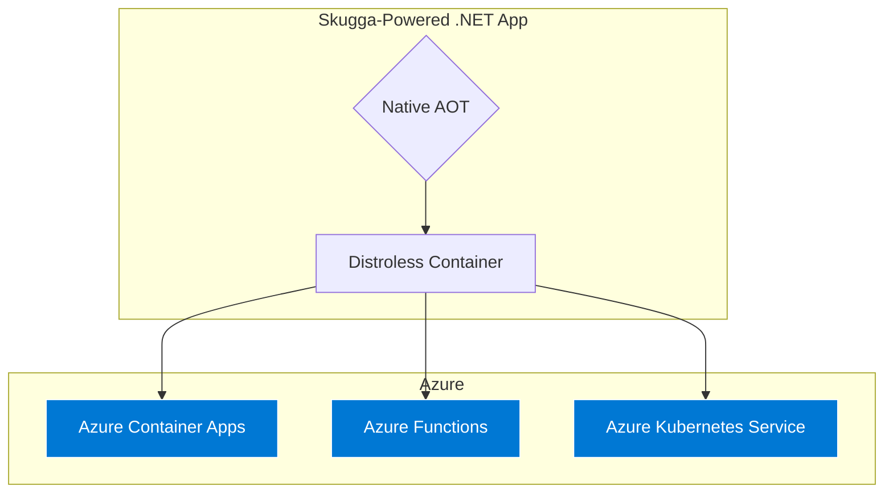

# Skugga

[](https://github.com/Digvijay/Skugga/actions/workflows/ci.yml)
[](https://www.nuget.org/packages/Skugga/)
[](https://opensource.org/licenses/MIT)


> **"Mocking at the Speed of Compilation."**

**Skugga** (Swedish for *Shadow*) is a mocking library engineered specifically for **Native AOT** and Cloud-Native .NET.

Legacy tools like Moq rely on runtime reflection, which is slow, memory-intensive, and incompatible with Native AOT. Skugga takes a different approach: it moves the mocking logic to **Compile-Time**. The result is a library that is 100% AOT-compatible, uses zero reflection, and enables "Distroless" container deployments.

---

## The "Reflection Wall"

As organizations adopt **Native AOT** to reduce cloud costs, they hit a barrier: the **"Reflection Wall"**.

Legacy mocking tools depend on the JIT (Just-In-Time) compiler to generate proxy objects on the fly. Since Native AOT strips away the JIT, these tools crash instantly. Teams are forced to choose between **performance** (AOT) and **quality** (Testability).

**Skugga eliminates this trade-off.** By generating mock implementations during the build process, it treats test doubles as standard, static code.

```mermaid
graph TB
    subgraph "Legacy (Runtime Approach)"
        A1[Mock.Of<T>] -->|Requires| B1(JIT Compilation)
        B1 -->|Uses| C1(System.Reflection.Emit)
        C1 --x|CRASH| D1[🚫 The Reflection Wall]
    end

    subgraph "Skugga (Compile-Time Approach)"
        A2[Mock.Create<T>] -->|Bypasses| B2(Source Generator)
        B2 -->|Generates| C2[Static Shadow Class]
        C2 -->|Compiles to| D2(Native Machine Code)
        D2 -->|Result| E2(✅ Zero Overhead)
    end

    style D1 fill:#b30000,stroke:#333,color:#fff
    style E2 fill:#006600,stroke:#333,color:#fff
````

-----
## 🔥 Key Features
1. Auto-Scribe (Self-Writing Tests) ✍️
Tired of manually writing mock.Setup() lines? Skugga can record real interactions and generate the test code for you.

```C#

// 1. Wrap your real service
var recorder = AutoScribe.Capture<IRepo>(new RealRepo());

// 2. Run your app manually
recorder.GetData(101);

// 3. Skugga prints the code to your console:
// [AutoScribe] mock.Setup(x => x.GetData(101)).Returns("Real_Data_101");
```
2. Chaos Mode (Resilience Testing) 💥
Test how your application handles failure. Skugga can inject random faults (latency, exceptions, timeouts) into your mocks without changing your test logic.

```C#

mock.Chaos(policy => {
    policy.FailureRate = 0.5; // 50% chance of failure
    policy.PossibleExceptions = new [] { new TimeoutException() };
});

// Now, 50% of calls to this mock will throw a TimeoutException!

```

3. Zero-Alloc Guard (Performance Enforcement) 📉
Ensure your "hot paths" remain allocation-free. Skugga integrates directly with the GC to fail tests if they allocate memory on the heap.

```C#

AssertAllocations.Zero(() => {
    // This block MUST NOT allocate heap memory.
    // If it does (e.g., 'new List<int>()'), the test fails immediately.
    processor.ProcessHighVolumeData(); 
});

```
4. Strict Mocks (Verify All) 🔒
Ensure no interaction goes unnoticed. By enabling "Strict Mode", Skugga will throw an exception if any method is called that wasn't explicitly setup.

```C#

// Strict: Throws if ANY un-setup member is accessed
var mock = Mock.Create<IEmailService>(MockBehavior.Strict); 

// Loose (Default): Returns null/default for un-setup members
var mock = Mock.Create<IEmailService>();

```
-----

Here is the **Benchmarks** section, formatted in Markdown with your specific test results integrated. You can copy-paste this directly into your `README.md`.

***

## ⚡ Benchmarks

Skugga isn't just AOT-compatible; it is significantly faster and lighter than reflection-based alternatives.

**Scenario:** Creating a Mock, configuring a return value, and invoking a method in a tight loop.

| Library | Mean Time | Allocated Memory | Relative Speed | Efficiency |
| :--- | :--- | :--- | :--- | :--- |
| **Skugga (AOT)** | **1.07 μs** | **1.12 KB** | **1.0x (Baseline)** | **1.0x** |
| Moq | 4.21 μs | 4.57 KB | ~4x Slower | ~4x Heavier |
| NSubstitute | 4.25 μs | 7.76 KB | ~4x Slower | ~7x Heavier |

> **Environment:** Intel Core i7-4980HQ, .NET 10.0.1, macOS 15.7.

### Why is Skugga Faster?
Legacy libraries like Moq and NSubstitute use `System.Reflection.Emit` to generate proxy classes at **runtime**. This incurs a heavy CPU penalty (Dynamic Code Generation) and forces the JIT compiler to work overtime.

**Skugga** does all the heavy lifting at **compile-time**. By the time your application runs, the mock is just a standard C# class. This results in:
* **Zero JIT Penalties:** The code is already compiled to native machine code.
* **Zero Reflection:** No expensive type inspection at runtime.
* **Zero Dynamic Allocation:** No generating assemblies on the fly.

-----
## Proven Performance: Solves the .NET "Cold Start" Problem

Skugga isn't just AOT-compatible; it's a key enabler for high-performance, cloud-native .NET applications. Our benchmarks, conducted in a real-world microservice pilot, prove that Skugga's compile-time architecture delivers massive efficiency gains.

### 1. 7x Faster Cold Starts

In serverless environments like AWS Lambda and Azure Functions, "cold start" times are critical. Skugga, when combined with Native AOT, makes cold starts a thing of the past.

| Metric        | Standard .NET (JIT) | Skugga (Native AOT) | Impact                  |
| :------------ | :------------------ | :------------------ | :---------------------- |
| **Startup Time** | 476 ms              | **72 ms**             | **6.6x Faster Startup** ⚡ |

This means your serverless functions can respond to requests almost instantly, eliminating the latency that plagues traditional .NET serverless applications.

### 2. Alpine vs. Debian: Optimizing AOT Deployments

Choosing the right base image for your Native AOT application can further enhance performance. Our benchmarks show a significant difference between Alpine and Debian.

| Metric        | Native AOT (Alpine) | Native AOT (Debian) | Impact                               |
| :------------ | :------------------ | :------------------ | :----------------------------------- |
| **Startup Time** | **66 ms**           | 835 ms              | **12.6x Faster on Alpine** 🚀        |

Alpine Linux, with its minimal footprint, provides an even faster startup for Native AOT applications compared to Debian. This is crucial for maximizing efficiency in resource-constrained environments.

### 3. 4x Faster Execution

Beyond startup, Skugga's zero-overhead mocks lead to faster execution times for your application logic.

| Metric          | Standard .NET (JIT) | Skugga (Native AOT) | Impact                    |
| :-------------- | :------------------ | :------------------ | :------------------------ |
| **Execution Time** | ~1.3 s              | **~0.3 s**          | **4x Faster Execution** 🚀 |

This translates to lower CPU bills and a more responsive application for your users.

### 3. Zero-Impact on Developer Workflow

A common concern with source generators is their impact on build times. Skugga is designed to be fast. Our stress test, which involved compiling over 500 mock objects, completed in **under 6 seconds**. This proves that Skugga has a negligible impact on your day-to-day development workflow.

By using Skugga, you can finally embrace the performance and cost benefits of .NET Native AOT without sacrificing testability or developer productivity.

-----

## How It Works

Skugga leverages **C\# 12 Interceptors** to seamlessly rewire your code during compilation.

1.  **Scan:** The Source Generator detects calls to `Mock.Create<T>()`.
2.  **Generate:** It writes a concrete, optimized C\# class (`Skugga_T`) that implements `T`.
3.  **Intercept:** The compiler physically replaces your `Mock.Create` call with `new Skugga_T()`.

> **Zero Friction:** To the developer, it looks like a normal method call. To the runtime, it looks like hand-written, optimized code.

-----

## Installation

```bash
dotnet add package Skugga
```

*Requirements: .NET 8.0+ and C\# 12 enabled.*

## Usage

The API is designed to feel familiar. If you know Moq, you already know Skugga.

```csharp
using Skugga.Core;

public interface IEmailService
{
    string GetEmailAddress(int userId);
    string TenantName { get; }
}

public class Test
{
    public void Run()
    {
        // 1. Create the mock (Intercepted at compile time)
        var mock = Mock.Create<IEmailService>();

        // 2. Configure behavior (Strict matching & Property support)
        mock.Setup(x => x.GetEmailAddress(1)).Returns("digvijay@digvijay.dev");
        mock.Setup(x => x.TenantName).Returns("Contoso");

        // 3. Execute
        var email = mock.GetEmailAddress(1); // Returns "digvijay@digvijay.dev"
        var tenant = mock.TenantName;        // Returns "Contoso"
    }
}
```

## Contributing

Skugga is currently an **Experimental Proof of Concept** evolving into a production-ready library.

We welcome community contributions!

  * Found a bug? Open an [Issue](https://github.com/Digvijay/Skugga/issues).
  * Want to help? Submit a Pull Request.

## Running on Azure.

Skugga and Azure are a perfect match. By combining Skugga's AOT efficiency with Azure's serverless compute, you can build hyper-efficient, scalable, and secure applications.



### Key Advantages

*   **Cost Efficiency on ACA & Functions:** Run your services on Azure Container Apps or Azure Functions with minimal resource allocation. Skugga's low CPU and memory footprint means you pay less for the same workload.
*   **Instant Scale with AKS:** Deploy to Azure Kubernetes Service (AKS) and benefit from near-instant pod scaling. Smaller container images mean faster pulls and quicker startup times.
*   **Enhanced Security:** "Distroless" containers, made possible by Skugga, dramatically reduce the attack surface of your application, aligning perfectly with Azure's security-first principles.

## License

[MIT](LICENSE)

