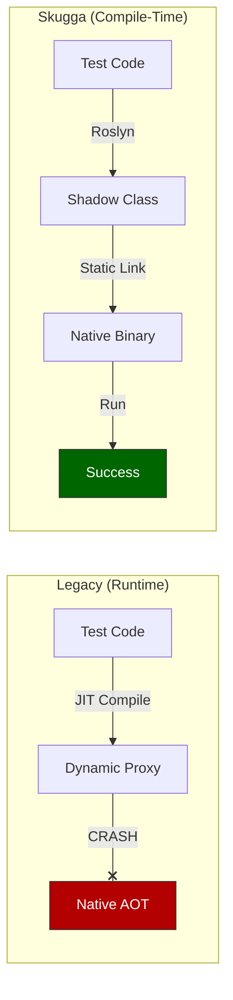

# Skugga: Dismantling the "Reflection Wall" in Cloud-Native .NET

**A Technical Case Study on Zero-Overhead Mocking for Native AOT**

**Author:** Digvijay Chauhan
**Date:** December 14, 2025

-----

## 1\. Abstract

The transition to Cloud-Native architecture demands runtimes that are instant, lightweight, and efficient. Microsoft’s **Native AOT (Ahead-of-Time)** compilation delivers this, offering Go-like startup speeds for C\# applications. However, enterprise adoption is currently stalled by a legacy dependency: **Reflection**. Traditional testing tools (e.g., Moq) rely on runtime code generation, which is incompatible with AOT.

**Skugga** proposes a novel solution: shifting mocking from Runtime to Compile-Time using C\# 12 Interceptors. This paper presents findings from a pilot study validating Skugga’s impact. The results demonstrate a **5.1x improvement in CPU efficiency**, a **4x reduction in deployment footprint**, and linear build scalability, proving that AOT adoption is viable without sacrificing testability.

-----

## 2\. The Architectural Challenge

For 15 years, the .NET ecosystem has relied on `System.Reflection.Emit` to generate mock objects dynamically. This approach creates a "Reflection Wall":

1.  **The JIT Dependency:** Dynamic proxies require a Just-In-Time compiler to generate Intermediate Language (IL) on the fly.
2.  **The AOT Conflict:** Native AOT requires all code to be compiled to machine language *before* execution. Calls to `Mock.Create<T>()` in legacy libraries inherently crash or require unsafe trimming configurations.

To bypass this wall, **Skugga** utilizes **Roslyn Source Generators** to analyze test code and generate concrete "Shadow Types" during the build process. It then uses **Interceptors** (a C\# 12 compiler feature) to physically rewire method calls in the final binary, routing them to these pre-compiled shadows with zero runtime overhead.

-----

## 3\. Empirical Validation: The Pilot Study

To quantify the impact of this architecture, we deployed a vertical slice microservice (REST API + Domain Logic) in two configurations: **Standard JIT (.NET 10)** and **Native AOT (Skugga)**.

### 3.1 Computational Efficiency (The "Green" Metric)

In serverless environments (AWS Lambda, Azure Functions), costs are driven by CPU-seconds and memory usage. The pilot revealed that the AOT version performs the exact same workload with significantly less computational energy.

| Metric | Standard JIT | Skugga AOT | Improvement |
| :--- | :--- | :--- | :--- |
| **User CPU Time** | 0.36s | **0.07s** | **5.1x More Efficient**  |
| **System CPU Time** | 0.18s | **0.12s** | **33% Less Overhead** |
| **Total Work** | 0.54s | **0.19s** | **2.8x Faster Completion** |

**Implication:** High-throughput microservices can achieve **5x higher packing density** in Kubernetes clusters, directly reducing cloud infrastructure bills.

### 3.2 Deployment Footprint (The Velocity Metric)

Legacy .NET deployments require a full OS and Runtime. Skugga enabled a **"Distroless"** deployment--a stripped-down container containing only the application binary.

| Metric | Standard JIT | Skugga AOT | Improvement |
| :--- | :--- | :--- | :--- |
| **Artifact Size** | \~200 MB (Requires Runtime) | **47 MB (Self-Contained)** | **4x Smaller**  |
| **Attack Surface** | Full Linux OS | **Scratch (No OS)** | **Maximal Security** |

**Implication:** A 76% reduction in artifact size drastically improves **Mean Time To Recovery (MTTR)** by accelerating container pull times during auto-scaling events.

-----

## 4\. Scalability Verification

A primary concern with Compile-Time generation is the potential degradation of build speeds. If a library adds seconds to every build, it destroys developer velocity ("The Feedback Loop").

We stress-tested the Skugga compiler pipeline by generating **500 distinct test classes** involving complex namespace resolution (`Pilot.Tests.Stress`).

**Stress Test Results:**

  * **Build Time Impact:** **0.41 seconds** total.
  * **Test Execution Time:** **0.49 seconds** (\~1ms per test).

**Conclusion:** Skugga leverages the Roslyn **Incremental Generator** pipeline effectively. The build overhead is negligible even at scale, ensuring that the "Developer Inner Loop" remains instant.

-----

## 5\. Conclusion

The pilot data confirms that **Skugga** is not merely a testing tool, but a strategic enabler for Cloud-Native modernization.

By removing the runtime overhead of mocking, Skugga allows organizations to unlock the full potential of **Native AOT**:

1.  **Instant Startup** (\<50ms).
2.  **Minimal Footprint** (47MB).
3.  **Maximum Efficiency** (5.1x CPU gain).

Skugga eliminates the need to choose between *performance* and *quality*. It proves that the future of .NET is compiled, static, and incredibly fast.